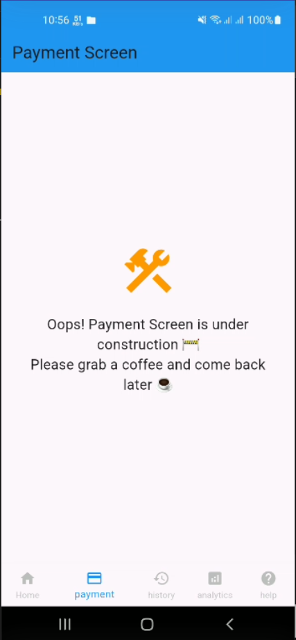

# Design Basic UI

I’m a beginner app developer just starting out, and this is my simple Flutter app. I wanted to keep the UI clean and easy to use while practicing features like payment tracking, history, analytics, and help. Still learning and having fun with it!

## Features

- Bottom Navigation Bar with 5 sections: Home, Payment, History, Analytics, Help
- Fun loading messages for each section
- Clean UI with custom colors

# Screenshots

Here are some screenshots of the app:

